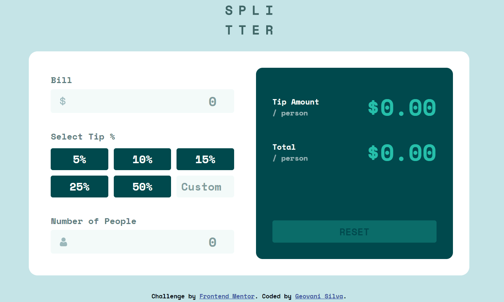

<h1 align="center">Tip calculator app</h1>

     <a href="##conceitos">Conceitos</a> | <a href="##funcionalidades">Funcionalidades</a> | <a href="##tecnologias">Tecnologias</a> | <a href="##solução">Solução</a>

 
> O projeto a seguir é uma solução do [Desafio Tip calculator app do Frontend Mentor](https://www.frontendmentor.io/challenges/tip-calculator-app-ugJNGbJUX) feita para praticar HTML, CSS e JavaScript. 

## Conceitos✏️
Principais conceitos que foram usados no desenvolvimento do projeto:
- HTML Semântico
- Flexbox
- CSS Grid
- Responsividade
- Validações de Input
- Propriedades e Eventos do DOM 

## Funcionalidades⚙️
Principais funcionalidades do projeto: 
- [x] Cálculo da gorjeta e do total da conta por pessoa
- [x] Validação de inputs com valores igual zero
- [x] Hover em todos os elementos interativos da página
- [x] Botão Reset que limpa todos os elementos

## Tecnologias🛠️
As seguintes ferramentas foram usadas no desenvolvimento do projeto:
- HTML
- CSS
- JavaScript

## Solução
Verifique a minha solução do desafio [clicando aqui]() 

Feito com 💙 e ☕ por [Geovani Silva](https://www.linkedin.com/in/geovani-silva-21298921b/)
